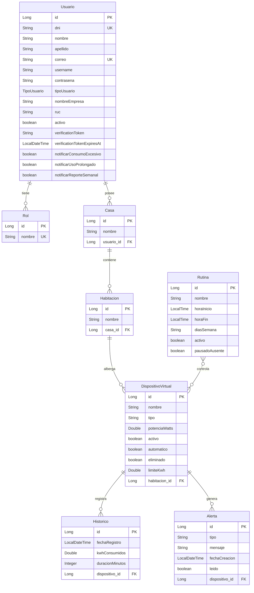

# EcoVolt - Estructura y Documentación del Backend

Este documento detalla la arquitectura, modelo de datos, flujo de seguridad y especificación completa de endpoints para el backend de **EcoVolt**, desarrollado sobre **Spring Boot** y **Java 21**.

---

## 1. Arquitectura General y Stack Tecnológico

El backend de EcoVolt sigue una arquitectura en capas (**Controller - Service - Repository - Entity**) y utiliza las siguientes tecnologías clave:

*   **Lenguaje y Framework Principal:** Java 21 y Spring Boot 3.3.2.
*   **Base de Datos y Persistencia:** PostgreSQL con Spring Data JPA y Hibernate para la persistencia relacional.
*   **Seguridad:** Spring Security con JSON Web Tokens (JWT) para autenticación sin estado (Stateless). Las contraseñas se almacenan cifradas utilizando BCrypt.
*   **Validaciones de Entrada:** Validaciones declarativas usando anotaciones de `jakarta.validation` (`@Valid`, `@NotNull`, `@Email`, `@Size`, etc.).
*   **Mapeo de Datos:** ModelMapper para la conversión bidireccional limpia entre Entidades y DTOs.
*   **Documentación:** Springdoc OpenAPI v2 (Swagger UI) integrado para autogenerar especificaciones OpenAPI en `/v3/api-docs` y visualizar la interfaz en `/swagger-ui.html`.
*   **Integración Externa:** Consulta a la API de RENIEC mediante `RestClient` de Spring para validar el DNI durante el registro y autocompletar la información personal del usuario.
*   **Manejo de Errores:** Centralizado a través de un `@RestControllerAdvice` que captura excepciones comunes y retorna respuestas de error estructuradas de forma consistente.

---

## 2. Estructura de Paquetes y Código Fuente

El código se organiza dentro del paquete base `com.ecovolt.demo` de la siguiente manera:

*   [Config](file:///C:/Users/danie/Documents/Ciclo_VI/Arqui_Web/demo/src/main/java/com/ecovolt/demo/Config): Clases de configuración global del framework.
    *   [ModelMapperConfig.java](file:///C:/Users/danie/Documents/Ciclo_VI/Arqui_Web/demo/src/main/java/com/ecovolt/demo/Config/ModelMapperConfig.java): Configuración del bean `ModelMapper`.
*   [Enums](file:///C:/Users/danie/Documents/Ciclo_VI/Arqui_Web/demo/src/main/java/com/ecovolt/demo/Enums): Enumeraciones compartidas por la aplicación.
    *   [TipoUsuario.java](file:///C:/Users/danie/Documents/Ciclo_VI/Arqui_Web/demo/src/main/java/com/ecovolt/demo/Enums/TipoUsuario.java): Define los tipos `PERSONAL` y `EMPRESARIAL`.
*   [controllers](file:///C:/Users/danie/Documents/Ciclo_VI/Arqui_Web/demo/src/main/java/com/ecovolt/demo/controllers): Controladores REST que manejan las peticiones HTTP y mapean los endpoints.
*   [dtos](file:///C:/Users/danie/Documents/Ciclo_VI/Arqui_Web/demo/src/main/java/com/ecovolt/demo/dtos): Clases DTO que definen los payloads de entrada y salida de la API, desacoplando la base de datos del cliente.
*   [entities](file:///C:/Users/danie/Documents/Ciclo_VI/Arqui_Web/demo/src/main/java/com/ecovolt/demo/entities): Clases de entidad JPA persistentes que representan las tablas de la base de datos PostgreSQL.
*   [exceptions](file:///C:/Users/danie/Documents/Ciclo_VI/Arqui_Web/demo/src/main/java/com/ecovolt/demo/exceptions): Clases de excepción personalizadas y el manejador global.
    *   [GlobalExceptionHandler.java](file:///C:/Users/danie/Documents/Ciclo_VI/Arqui_Web/demo/src/main/java/com/ecovolt/demo/exceptions/GlobalExceptionHandler.java): Mapea excepciones a respuestas estandarizadas.
*   [repositories](file:///C:/Users/danie/Documents/Ciclo_VI/Arqui_Web/demo/src/main/java/com/ecovolt/demo/repositories): Interfaces JPA que extienden de `JpaRepository` para interactuar con la base de datos.
*   [security](file:///C:/Users/danie/Documents/Ciclo_VI/Arqui_Web/demo/src/main/java/com/ecovolt/demo/security): Componentes de autenticación y autorización.
    *   [SecurityConfig.java](file:///C:/Users/danie/Documents/Ciclo_VI/Arqui_Web/demo/src/main/java/com/ecovolt/demo/security/SecurityConfig.java): Configuración principal de Spring Security, filtros y roles.
    *   [JwtAuthenticationFilter.java](file:///C:/Users/danie/Documents/Ciclo_VI/Arqui_Web/demo/src/main/java/com/ecovolt/demo/security/JwtAuthenticationFilter.java): Filtro interceptor para extraer y validar JWTs en peticiones HTTP.
    *   [JwtService.java](file:///C:/Users/danie/Documents/Ciclo_VI/Arqui_Web/demo/src/main/java/com/ecovolt/demo/security/JwtService.java): Genera, parsea y valida tokens JWT.
*   [services](file:///C:/Users/danie/Documents/Ciclo_VI/Arqui_Web/demo/src/main/java/com/ecovolt/demo/services): Interfaces de servicios que declaran la lógica de negocio.
*   [serviceimpl](file:///C:/Users/danie/Documents/Ciclo_VI/Arqui_Web/demo/src/main/java/com/ecovolt/demo/serviceimpl): Implementación de la lógica de negocio.
    *   *Nota:* Las escenas ([EscenaMemoriaService.java](file:///C:/Users/danie/Documents/Ciclo_VI/Arqui_Web/demo/src/main/java/com/ecovolt/demo/serviceimpl/EscenaMemoriaService.java)) y rutinas ([RutinaMemoriaService.java](file:///C:/Users/danie/Documents/Ciclo_VI/Arqui_Web/demo/src/main/java/com/ecovolt/demo/serviceimpl/RutinaMemoriaService.java)) se manejan en memoria utilizando mapas concurrentes.

---

## 3. Modelo de Datos (Entidades y Relaciones)

El backend define 8 entidades principales persistidas en base de datos. A continuación se detallan sus atributos y relaciones:

### Listado de Entidades

1.  **[Usuario](file:///C:/Users/danie/Documents/Ciclo_VI/Arqui_Web/demo/src/main/java/com/ecovolt/demo/entities/Usuario.java):** Almacena las credenciales y configuraciones del cliente (DNI, correo, contrasena, activo, etc.). Soporta perfiles Personal y Empresarial (RUC, nombreEmpresa).
2.  **[Rol](file:///C:/Users/danie/Documents/Ciclo_VI/Arqui_Web/demo/src/main/java/com/ecovolt/demo/entities/Rol.java):** Modela el rol de seguridad asignado a los usuarios (e.g. `ROLE_PERSONAL`, `ROLE_EMPRESARIAL`).
3.  **[Casa](file:///C:/Users/danie/Documents/Ciclo_VI/Arqui_Web/demo/src/main/java/com/ecovolt/demo/entities/Casa.java):** Representa el hogar o local físico de un usuario.
4.  **[Habitacion](file:///C:/Users/danie/Documents/Ciclo_VI/Arqui_Web/demo/src/main/java/com/ecovolt/demo/entities/Habitacion.java):** Ambientes asociados a una casa (e.g. Sala, Cocina, Oficina).
5.  **[DispositivoVirtual](file:///C:/Users/danie/Documents/Ciclo_VI/Arqui_Web/demo/src/main/java/com/ecovolt/demo/entities/DispositivoVirtual.java):** Electrodomésticos u objetos inteligentes en un ambiente. Mantiene el estado encendido/apagado (`activo`), modo automático/manual (`automatico`) y límite de consumo (`limiteKwh`).
6.  **[Historico](file:///C:/Users/danie/Documents/Ciclo_VI/Arqui_Web/demo/src/main/java/com/ecovolt/demo/entities/Historico.java):** Registros periódicos de consumo eléctrico en kWh por dispositivo virtual con su respectiva fecha y duración en minutos.
7.  **[Alerta](file:///C:/Users/danie/Documents/Ciclo_VI/Arqui_Web/demo/src/main/java/com/ecovolt/demo/entities/Alerta.java):** Notificaciones generadas por consumo excesivo o uso prolongado de dispositivos.
8.  **[Rutina](file:///C:/Users/danie/Documents/Ciclo_VI/Arqui_Web/demo/src/main/java/com/ecovolt/demo/entities/Rutina.java):** Acciones programadas de encendido/apagado en horas y días específicos sobre un grupo de dispositivos.

### Diagrama Entidad-Relación (ERD)

A continuación se muestra el diseño relacional y relaciones de multiplicidad entre entidades:



---

## 4. Seguridad, Autenticación y Flujo de Registro

El backend implementa un flujo estricto de autenticación basado en roles y tokens seguros:

1.  **Registro (`POST /api/v1/auth/register`):**
    *   El usuario proporciona su DNI, correo, contraseña y tipo de uso (`PERSONAL` o `EMPRESARIAL`).
    *   El backend invoca a la API externa de RENIEC usando [ReniecClient.java](file:///C:/Users/danie/Documents/Ciclo_VI/Arqui_Web/demo/src/main/java/com/ecovolt/demo/services/feingservice/ReniecClient.java) para verificar la validez del DNI, obtener su nombre y apellidos reales, y generar su nombre de usuario automáticamente.
    *   Se crea el usuario con estado `activo = false` y se genera un token de verificación numérico aleatorio de 6 dígitos con expiración de 24 horas.
    *   Si el usuario es de tipo `PERSONAL`, el sistema autogenera una "Casa Demo" con ambientes y dispositivos preconfigurados para facilitar pruebas.
2.  **Verificación (`POST /api/v1/auth/verify-email`):**
    *   El usuario envía su correo y el código de verificación recibido.
    *   Si coincide y está vigente, el usuario se marca como `activo = true` y ya puede iniciar sesión.
3.  **Inicio de Sesión (`POST /api/v1/auth/login`):**
    *   El usuario ingresa su correo y contraseña.
    *   El backend autentica al usuario a través del `AuthenticationManager` de Spring Security, que verifica la contraseña encriptada.
    *   Se genera y retorna un token JWT firmado de tipo Bearer (expira por defecto en 24 horas).
4.  **Autorización en Rutas Protegidas:**
    *   Todas las llamadas protegidas requieren el header: `Authorization: Bearer <JWT>`.
    *   [JwtAuthenticationFilter.java](file:///C:/Users/danie/Documents/Ciclo_VI/Arqui_Web/demo/src/main/java/com/ecovolt/demo/security/JwtAuthenticationFilter.java) intercepta la petición, valida la firma del token y extrae el usuario e identificadores para inyectar su contexto en la sesión.
    *   Las rutas bajo `/api/v1/consumption/**`, `/api/v1/reports/**`, `/api/v1/alerts/**`, `/api/v1/dashboard/**` y `/api/v1/devices/**` están restringidas por rol y solo admiten tokens de usuarios con roles `PERSONAL` o `EMPRESARIAL` (configurado en [SecurityConfig.java](file:///C:/Users/danie/Documents/Ciclo_VI/Arqui_Web/demo/src/main/java/com/ecovolt/demo/security/SecurityConfig.java)).

---

## 5. Respuestas de API y Manejo de Errores Estandarizado

Todas las respuestas REST del backend (excluyendo descargas de archivos binarios como reportes en PDF) devuelven el envoltorio estandarizado [RespuestaApi.java](file:///C:/Users/danie/Documents/Ciclo_VI/Arqui_Web/demo/src/main/java/com/ecovolt/demo/dtos/RespuestaApi.java):

### Estructura de Respuesta Exitosa (JSON)
```json
{
  "success": true,
  "message": "Operación completada con éxito",
  "data": { ... } // DTO específico o null
}
```

### Estructura de Respuesta de Error (JSON)
Manejado por [GlobalExceptionHandler.java](file:///C:/Users/danie/Documents/Ciclo_VI/Arqui_Web/demo/src/main/java/com/ecovolt/demo/exceptions/GlobalExceptionHandler.java):
```json
{
  "success": false,
  "message": "Detalle del error ocurrido (e.g. validación fallida, recurso no encontrado)",
  "data": null
}
```

---

## 6. Catálogo Detallado de Endpoints por Módulo

A continuación se presenta la referencia técnica de todos los controladores de la aplicación:

### 6.1 Módulo de Autenticación
Prefijo de rutas: `/api/v1/auth` (Todas las rutas de este módulo son **Públicas** y no requieren token JWT).

| Endpoint | Método | Payload Requerido (JSON) | Estructura de Respuesta `data` | Descripción |
| :--- | :--- | :--- | :--- | :--- |
| `/login` | `POST` | `correo` (email), `contrasena` (texto) | `token` (string), `token_type` ("Bearer"), `expires_in` (segundos) | Autentica al usuario activo y devuelve su token JWT de acceso. |
| `/register` | `POST` | `dni` (8 digitos), `correo` (email), `contrasena` (min 8 car.), `tipo_uso` ("PERSONAL" o "EMPRESARIAL"). Si es empresarial: `nombre_empresa`, `ruc` (11 digitos) | `correo` (string), `verification_token` (código 6 digitos), `expires_at` (LocalDateTime), `verification_link` (url) | Registra un nuevo usuario inactivo validándolo con RENIEC y genera su código de activación. |
| `/verify-email` | `POST` | `correo` (email), `codigo` (código de 6 dígitos de verificación) | `null` | Activa la cuenta del usuario si el token coincide y está dentro del periodo de validez. |
| `/resend-verification` | `POST` | `correo` (email) | `correo` (string), `verification_token` (código), `expires_at`, `verification_link` | Invalida el token actual y genera uno nuevo enviándolo por el canal de verificación simulado. |

---

### 6.2 Módulo de Usuarios y Roles
Prefijo de rutas: `/api/v1/usuarios` (Requieren **Token JWT**).

| Endpoint | Método | Payload Requerido / Path Variables | Estructura de Respuesta `data` | Descripción |
| :--- | :--- | :--- | :--- | :--- |
| `/insertarusuario` | `POST` | Body: Entidad `Usuario` completa | `UsuarioDTO` | Inserta un usuario directamente en base de datos. Usualmente reservado para pruebas o administración. |
| `/listarusuarios` | `GET` | Ninguno | List de `UsuarioDTO` | Retorna la lista de todos los usuarios registrados en el sistema. |
| `/me` | `GET` | Ninguno (Usuario de sesión) | `UsuarioDTO` | Retorna la información de perfil del usuario actualmente autenticado (extrae el correo del token JWT). |
| `/encontrarusuario/{id}` | `GET` | Path variable: `id` (Long) | `UsuarioDTO` | Busca y retorna la información de perfil de un usuario específico. |
| `/actualizarusuario/{id}` | `PUT` | Path: `id` (Long), Body: `nombre` (max 120 caracteres) | `UsuarioDTO` | Actualiza el nombre/perfil básico del usuario especificado. |
| `/{id}/password` | `PATCH` | Path: `id` (Long), Body: `contrasena_actual` (string), `nueva_contrasena` (string) | `null` | Permite al usuario cambiar su contraseña validando sus credenciales previas. |
| `/{id}/notification-settings` | `PATCH` | Path: `id` (Long), Body: `consumo_excesivo` (bool), `uso_prolongado` (bool), `reporte_semanal` (bool) | `UsuarioDTO` | Actualiza las preferencias de alertas y notificaciones del usuario. |
| `/{id}` | `DELETE` | Path variable: `id` (Long) | `null` | Elimina de forma física el registro del usuario en el sistema. |
| `/roles` | `POST` | Body: Entidad `Rol` | `Rol` | Crea un nuevo rol en el sistema de seguridad. |
| `/roles` | `GET` | Ninguno | List de `Rol` | Lista todos los roles registrados en la base de datos. |
| `/roles/{id}` | `GET` | Path variable: `id` (Long) | `Rol` | Obtiene el detalle de un rol por su id. |
| `/roles/{id}` | `PUT` | Path: `id` (Long), Body: `Rol` actualizado | `Rol` | Modifica el nombre de un rol existente. |
| `/roles/{id}` | `DELETE` | Path variable: `id` (Long) | `null` | Elimina el rol del sistema. |

---

### 6.3 Módulo de Casas
Prefijo de rutas: `/api/v1/homes` (Requieren **Token JWT** y Rol `PERSONAL` o `EMPRESARIAL`).

| Endpoint | Método | Payload Requerido / Path Variables | Estructura de Respuesta `data` | Descripción |
| :--- | :--- | :--- | :--- | :--- |
| `/insertarcasa` | `POST` | Body: `CasaDTO` (`nombre`, `usuario_id`) | `CasaDTO` | Registra una nueva casa asociada al usuario. |
| `/listarcasas` | `GET` | Ninguno (Usuario de sesión) | List de `CasaDTO` | Retorna únicamente las casas pertenecientes al usuario autenticado. |
| `/encontrarcasa/{id}` | `GET` | Path variable: `id` (Long) | `CasaDTO` | Obtiene el detalle de una casa por su ID. |
| `/actualizarcasa/{id}` | `PUT` | Path: `id` (Long), Body: `CasaDTO` | `CasaDTO` | Actualiza la información básica (nombre) de la casa. |
| `/eliminarcasa/{id}` | `DELETE` | Path variable: `id` (Long) | `null` | Elimina físicamente la casa y desvincula habitaciones de forma en cascada. |
| `/{id}/away-mode` | `PATCH` | Path: `id` (Long), Body: `away_mode_enabled` (boolean) | `home_id` (Long), `away_mode_enabled` (bool), `paused_routines` (número) | **Modo Ausente:** Cambia el estado ausente de la casa. Al activarse, apaga y pausa automáticamente todas las rutinas de la casa para ahorrar energía. |

---

### 6.4 Módulo de Habitaciones
Prefijo de rutas: `/api/v1/rooms` (Requieren **Token JWT**).

| Endpoint | Método | Payload Requerido / Path Variables | Estructura de Respuesta `data` | Descripción |
| :--- | :--- | :--- | :--- | :--- |
| `/insertarhabitacion` | `POST` | Body: `CrearHabitacionDto` (`casa_id` / `home_id`, `nombre` max 80) | `HabitacionDTO` | Registra un ambiente dentro de una casa específica. |
| `/listarhabitaciones` | `GET` | Ninguno (Usuario de sesión) | List de `HabitacionDTO` | Obtiene únicamente las habitaciones pertenecientes a las casas del usuario autenticado. |
| `/encontrarhabitacion/{id}` | `GET` | Path variable: `id` (Long) | `HabitacionDTO` | Busca un ambiente específico por su ID. |
| `/actualizarhabitacion/{id}` | `PUT` | Path: `id` (Long), Body: `CrearHabitacionDto` | `HabitacionDTO` | Modifica el nombre o vinculación de casa del ambiente. |
| `/eliminarhabitacion/{id}` | `DELETE` | Path variable: `id` (Long) | `null` | Elimina el ambiente físicamente del sistema. |

---

### 6.5 Módulo de Dispositivos Virtuales
Prefijo de rutas: `/api/v1/devices` (Requieren **Token JWT** y Rol `PERSONAL` o `EMPRESARIAL`).

| Endpoint | Método | Payload Requerido / Path Variables | Estructura de Respuesta `data` | Descripción |
| :--- | :--- | :--- | :--- | :--- |
| `/` o `/insertar` | `POST` | Body: `CrearDispositivoDto` (`room_id`, `nombre`, `tipo`, `activo`, `automatico`, `limite_kwh`) | `DispositivoDTO` | Registra un dispositivo virtual en una habitación y calcula su potencia base de consumo según su tipo. |
| `/` o `/listar` | `GET` | Ninguno (Usuario de sesión) | List de `DispositivoDTO` | Retorna únicamente los dispositivos vigentes pertenecientes al usuario autenticado (excluye eliminados). |
| `/{id}` | `GET` | Path variable: `id` (Long) | `DispositivoDTO` | Retorna el detalle completo de un dispositivo por su ID. |
| `/{id}/room` | `PATCH` | Path: `id` (Long), Body: `AsignarHabitacionDispositivoDto` (`room_id`) | `DispositivoDTO` | Reasigna el dispositivo virtual a un ambiente diferente. |
| `/{id}` | `PUT` | Path: `id` (Long), Body: `ActualizarDispositivoDto` | `DispositivoDTO` | Modifica los datos del dispositivo (nombre, tipo, límites, etc.). |
| `/{id}` | `DELETE` | Path variable: `id` (Long) | `null` | **Borrado Lógico:** Marca el dispositivo como eliminado (`eliminado = true`) para conservar la integridad referencial de reportes históricos. |
| `/{id}/status` | `PATCH` | Path: `id` (Long), Body: `EstadoActualDispositivoDto` (`status`: "ON"/"OFF") | `DispositivoDTO` | Enciende o apaga el dispositivo virtual manualmente. |
| `/{id}/mode` | `PATCH` | Path: `id` (Long), Body: `ModoDispositivoDto` (`mode`: "AUTOMATIC"/"MANUAL") | `DispositivoDTO` | Alterna el control del dispositivo entre manual y automático (rutinas). |

---

### 6.6 Módulo de Consumo e Históricos
Prefijo de rutas: `/api/v1/consumption` (Requieren **Token JWT** y Rol `PERSONAL` o `EMPRESARIAL`).

| Endpoint | Método | Payload Requerido / Path Variables | Estructura de Respuesta `data` | Descripción |
| :--- | :--- | :--- | :--- | :--- |
| `/history` | `POST` | Body: `HistoricoDTO` (`fecha_registro`, `kwh_consumidos`, `duracion_minutos`, `dispositivo_id`) | `HistoricoDTO` | Añade un registro manual de historial de consumo de energía para un dispositivo. |
| `/history` | `GET` | Ninguno (Usuario de sesión) | List de `HistoricoDTO` | Obtiene únicamente el historial de consumos de los dispositivos del usuario autenticado. |
| `/history/{id}` | `GET` | Path variable: `id` (Long) | `HistoricoDTO` | Obtiene un registro histórico por su ID. |
| `/history/{id}` | `PUT` | Path: `id` (Long), Body: `HistoricoDTO` | `HistoricoDTO` | Actualiza un registro histórico de consumo específico. |
| `/history/{id}` | `DELETE` | Path variable: `id` (Long) | `null` | Elimina un registro histórico de consumo físico. |
| `/rooms/{id}` | `GET` | Path variable: `id` (Long) | `ConsumoHabitacionDTO` | Calcula el consumo agregado del ambiente especificado y el desglose de los dispositivos dentro de él. |
| `/compare` | `GET` | Ninguno | `ComparacionConsumoRespuestaDto` | Compara el uso de energía y distribución porcentual del total consumido entre todos los dispositivos del usuario de sesión. |
| `/devices/{id}` | `GET` | Path variable: `id` (Long) | `ConsumoRespuestaDto` | Retorna las métricas agregadas de consumo de un dispositivo para intervalos diario, semanal y mensual. |

---

### 6.7 Módulo de Alertas y Límites
Prefijo de rutas: `/api/v1/alerts` (Requieren **Token JWT** y Rol `PERSONAL` o `EMPRESARIAL`).

| Endpoint | Método | Payload Requerido / Path Variables | Estructura de Respuesta `data` | Descripción |
| :--- | :--- | :--- | :--- | :--- |
| `/` | `POST` | Body: `AlertaDTO` | `AlertaDTO` | Registra una alerta en el sistema de manera directa. |
| `/` | `GET` | Ninguno (Usuario de sesión) | List de `AlertaDTO` | Obtiene únicamente las alertas del usuario autenticado. |
| `/{id}` | `GET` | Path variable: `id` (Long) | `AlertaDTO` | Obtiene los detalles de una alerta por su ID. |
| `/{id}` | `PUT` | Path: `id` (Long), Body: `AlertaDTO` | `AlertaDTO` | Modifica el contenido de una alerta específica. |
| `/{id}` | `DELETE` | Path variable: `id` (Long) | `null` | Elimina físicamente el registro de la alerta. |
| `/limits` | `POST` | Body: `LimiteAlertaSolicitudDto` (`device_id`, `limit_kwh`) | `LimiteRespuestaDto` | Configura el límite de consumo de kWh a partir del cual el dispositivo generará alertas. |
| `/limits/{dispositivoId}` | `PUT` | Path: `dispositivoId` (Long), Body: `LimiteAlertaSolicitudDto` | `LimiteRespuestaDto` | Actualiza el umbral de límite de alerta configurado para el dispositivo. |
| `/history` | `GET` | Ninguno | List de `AlertaDTO` | Retorna el historial completo de alertas pertenecientes al usuario autenticado. |
| `/filter` | `GET` | Query params: `device` (Long), `from` (date `yyyy-MM-dd`), `to` (date `yyyy-MM-dd`) | List de `AlertaDTO` | Filtra las alertas del usuario según dispositivo y/o rango de fechas de emisión. |
| `/{alertaId}/read` | `PATCH` | Path variable: `alertaId` (Long) | `AlertaDTO` | Marca la alerta indicada como leída (`leido = true`). |

---

### 6.8 Módulo de Escenas (En Memoria)
Prefijo de rutas: `/api/v1/scenes` (Requieren **Token JWT**).

*Nota: Administrado temporalmente en memoria a través de `EscenaMemoriaService`.*

| Endpoint | Método | Payload Requerido / Path Variables | Estructura de Respuesta `data` | Descripción |
| :--- | :--- | :--- | :--- | :--- |
| `/` | `POST` | Body: `CrearEscenaDto` (`nombre`, list de dispositivos con `desired_on` y `device_id`) | `EscenaDTO` | Registra una escena definiendo los estados de encendido/apagado deseados para múltiples dispositivos virtuales. |
| `/` | `GET` | Ninguno (Usuario de sesión) | List de `EscenaDTO` | Obtiene únicamente las escenas creadas por el usuario autenticado (filtradas por propiedad de sus dispositivos). |
| `/{id}` | `GET` | Path variable: `id` (Long) | `EscenaDTO` | Obtiene el detalle de una escena en particular. |
| `/{id}` | `PUT` | Path: `id` (Long), Body: `CrearEscenaDto` | `EscenaDTO` | Modifica la configuración de dispositivos y estados asociados a la escena. |
| `/{id}` | `DELETE` | Path variable: `id` (Long) | `null` | Elimina la escena del almacenamiento. |
| `/{id}/activate` | `POST` | Path variable: `id` (Long) | `ActivacionEscenaDTO` | **Ejecución:** Aplica en bloque los estados (`ON`/`OFF`) configurados en la escena a todos sus dispositivos asociados. |

---

### 6.9 Módulo de Rutinas (En Memoria)
Prefijo de rutas: `/api/v1/routines` (Requieren **Token JWT**).

*Nota: Administrado en memoria mediante `RutinaMemoriaService`.*

| Endpoint | Método | Payload Requerido / Path Variables | Estructura de Respuesta `data` | Descripción |
| :--- | :--- | :--- | :--- | :--- |
| `/` | `POST` | Body: `CrearRutinaDto` (`home_id`, `nombre`, `tiempoEjecucion` ("HH:mm"), `diasSemana`, `acciones`) | `RutinaDTO` | Programa una rutina periódica asignando una hora y días específicos de ejecución para alternar estados de dispositivos. |
| `/` | `GET` | Ninguno (Usuario de sesión) | List de `RutinaDTO` | Retorna únicamente las rutinas pertenecientes a las casas del usuario autenticado. |
| `/{id}` | `GET` | Path variable: `id` (Long) | `RutinaDTO` | Obtiene el detalle de una rutina. |
| `/{id}` | `PATCH` | Path: `id` (Long), Body: `ActualizarRutinaDto` | `RutinaDTO` | Modifica parcialmente la configuración de horario, días, acciones o habilitación de la rutina. |
| `/{id}` | `DELETE` | Path variable: `id` (Long) | `null` | Elimina la rutina de la lista de programación. |

---

### 6.10 Módulo de Panel (Dashboard)
Prefijo de rutas: `/api/v1/dashboard` (Requieren **Token JWT** y Rol `PERSONAL` o `EMPRESARIAL`).

| Endpoint | Método | Payload Requerido / Path Variables | Estructura de Respuesta `data` | Descripción |
| :--- | :--- | :--- | :--- | :--- |
| `/summary` | `GET` | Ninguno | `ResumenPanelDto` | Retorna las métricas consolidadas (consumo, costos y variaciones porcentuales) para el panel principal del dashboard. |
| `/devices` | `GET` | Ninguno | List de `DispositivoPanelDto` | Retorna los dispositivos con su estado actual listos para el control directo en el panel del dashboard. |
| `/scenes-routines` | `GET` | Ninguno (Usuario de sesión) | `EscenasRutinasPanelDto` | Devuelve de forma consolidada únicamente las escenas y rutinas pertenecientes al usuario autenticado. |
| `/scenes/{id}/activate` | `POST` | Path variable: `id` (Long) | `ActivacionEscenaDTO` | Activa la escena especificada directamente desde la vista del dashboard. |
| `/routines/{id}/pause` | `PATCH` | Path variable: `id` (Long) | `RutinaDTO` | Pausa o reanuda la rutina programada desde los controles rápidos del panel. |
| `/activity` | `GET` | Ninguno | List de `ActividadPanelDto` | Devuelve una lista de la actividad y registros de acciones ejecutadas recientemente por el usuario de sesión. |

---

### 6.11 Módulo de Reportes y Exportación
Prefijo de rutas: `/api/v1/reports` (Requieren **Token JWT** y Rol `PERSONAL` o `EMPRESARIAL`).

| Endpoint | Método | Payload Requerido / Path Variables | Tipo de Retorno / Estructura | Descripción |
| :--- | :--- | :--- | :--- | :--- |
| `/` | `GET` | Ninguno | `RespuestaApi<ReporteRespuestaDto>` | Genera un resumen analítico agregado del consumo de energía e incidentes del usuario autenticado. |
| `/export/pdf` | `GET` | Ninguno | **Archivo Binario** (`application/pdf`) | **Exportar a PDF:** Genera un reporte físico exportable y descargable en PDF que detalla el diagnóstico del consumo energético del hogar o establecimiento. |

---

## 7. Lógica y Características Especiales

*   **Simulador Activo de Consumo Eléctrico (`SimuladorConsumoService`):**
    El backend incluye un simulador automático en segundo plano. Cuando un dispositivo virtual tiene estado `status = "ON"` (activo), el simulador añade periódicamente registros históricos de consumo basados en la potencia del electrodoméstico multiplicada por la duración en minutos que permaneció encendido.
*   **Diccionario de Potencia Base por Tipo:**
    Al crear un dispositivo virtual, el sistema asigna automáticamente la potencia base (en Watts) según el tipo de electrodoméstico (por ejemplo: `tv` = 100W, `luz` = 15W, `refrigerador` = 350W, etc.) evitando que el usuario deba conocer y registrar este dato técnico manualmente.
*   **Modo Ausente:**
    El sistema permite activar un flag de modo ausente para una casa completa. Al hacerlo, el backend apaga transaccionalmente todos los dispositivos de esa casa y pausa todas las rutinas registradas para evitar fugas de energía eléctrica mientras el establecimiento u hogar se encuentra desocupado. Al desactivarse, las rutinas recuperan su programación habitual.
*   **Gestión en Memoria Concurrente:**
    Las rutinas y escenas de EcoVolt se implementan a nivel lógico en memoria a través de `ConcurrentHashMap` y `AtomicLong` para la simulación interactiva y rápida de estados y activaciones sin forzar transacciones de base de datos costosas. Adicionalmente, el sistema realiza consultas relacionales para filtrar estos elementos en memoria y asegurar que el usuario autenticado solo interactúe con sus propias rutinas y escenas.
